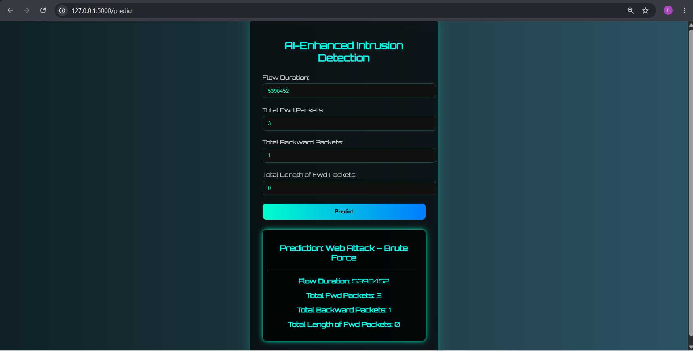
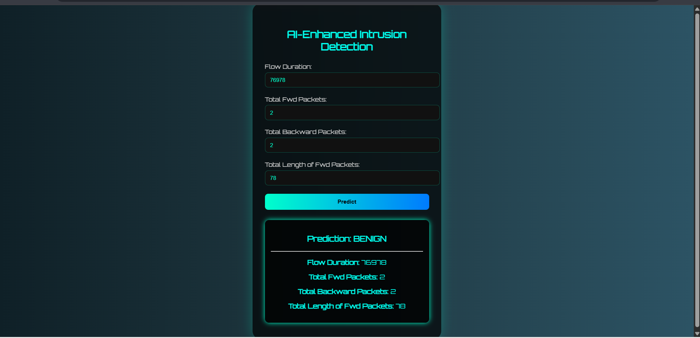

# 🛡️ AI-Enhanced Intrusion Detection System (IDS)

### Cybersecurity Threat Detection Using Machine Learning

---

## 📌 Project Description

In today's interconnected digital world, protecting organizational networks and sensitive information from cyber threats is a critical challenge. This project presents an **AI-Enhanced Intrusion Detection System (IDS)** that utilizes **Machine Learning** techniques to identify and classify network intrusions with improved accuracy.

The system is built using a **Random Forest Classifier** trained on a balanced intrusion dataset. Users can enter network traffic parameters through a web interface, and the model predicts whether the traffic is normal or represents a potential cyber attack.

This project demonstrates the practical application of Artificial Intelligence in strengthening cybersecurity defenses against modern threats.

---

## 🎯 Objectives

- Detect malicious network activities using Machine Learning.
- Classify network traffic as normal or suspicious.
- Provide a simple and interactive web interface for predictions.
- Improve intrusion detection accuracy using balanced datasets.
- Demonstrate the integration of AI with cybersecurity solutions.

---

## 🛠️ Technologies Used

- **Python 3.10+**
- **Flask** (Backend Framework)
- **HTML5**
- **CSS3**
- **Pandas**
- **NumPy**
- **Scikit-Learn**
- **Imbalanced-Learn (SMOTE)**
- **Joblib**
- **Jupyter Notebook**

---

## 🧠 Machine Learning Model

The project uses a **Random Forest Classifier** trained on network intrusion data.

### Features Used

- Flow Duration
- Total Forward Packets
- Total Backward Packets
- Total Length of Forward Packets

### Model File

```bash
random_forest_model_4_features.joblib
```

The model is trained on a balanced dataset to improve classification performance and reduce bias toward majority classes.

---

## 📂 Dataset

Dataset File:

```bash
web_attacks_balanced.csv
```

The dataset contains network traffic records with attack labels and was preprocessed before training.

### Example Features

| Feature                     | Description                    |
| --------------------------- | ------------------------------ |
| Flow Duration               | Total duration of network flow |
| Total Fwd Packets           | Number of forward packets      |
| Total Backward Packets      | Number of backward packets     |
| Total Length of Fwd Packets | Total size of forward packets  |

---

## 📁 Project Structure

```bash
AI-ENHANCED-INTRUSION-DETECTION-SYSTEM/
│
├── CYBER_PROJECT/
│   ├── templates/
│   │   └── index.html
│   │
│   ├── app.py
│   ├── random_forest_model_4_features.joblib
│   ├── web_attacks_balanced.csv
│   ├── requirements.txt
│   ├── Untitled.ipynb
│   └── README.md
│
├── screenshots/
│   ├── home.png
│   ├── prediction.png
│   └── result.png
│
├── Documentation/
│   └── Project_Report.pdf
│
└── README.md
```

---

## 📸 Screenshots

### Prediction 1



### Prediction 2



---

## ⚙️ Installation & Setup

### Clone Repository

```bash
git clone <repository-url>
cd CYBER_PROJECT
```

### Create Virtual Environment

#### Windows

```bash
python -m venv venv
venv\Scripts\activate
```

#### Linux / macOS

```bash
python3 -m venv venv
source venv/bin/activate
```

---

### Install Dependencies

```bash
pip install -r requirements.txt
```

If requirements file does not work:

```bash
pip install flask pandas numpy scikit-learn joblib imbalanced-learn
```

---

## ▶️ Running the Application

```bash
python app.py
```

Open browser:

```text
http://127.0.0.1:5000
```

---

## 🔍 System Workflow

1. User enters network traffic values.
2. Flask receives the input.
3. Random Forest model processes the features.
4. Model predicts traffic category.
5. Prediction is displayed on the web interface.

---

## 🚀 Features

- Machine Learning based intrusion detection.
- Flask-powered web interface.
- Fast prediction results.
- Balanced dataset training.
- User-friendly cybersecurity dashboard.
- Random Forest classification model.

---

## ✅ Advantages

- High classification accuracy.
- Easy to use interface.
- Fast prediction speed.
- Demonstrates AI in cybersecurity.
- Can be extended for real-time monitoring.

---

## ❌ Limitations

- Uses offline dataset.
- No live packet sniffing.
- No automatic threat response.
- Requires retraining for new attack patterns.

---

## 📌 Conclusion

The AI-Enhanced Intrusion Detection System demonstrates how Machine Learning can be applied to cybersecurity for identifying suspicious network behavior. By leveraging a Random Forest Classifier and a balanced intrusion dataset, the system provides an effective and scalable approach for intrusion detection. The project serves as a strong foundation for building advanced cybersecurity solutions capable of handling modern threats.

---

## 👨‍💻 Developed By

**Bilal Mirje**

---
